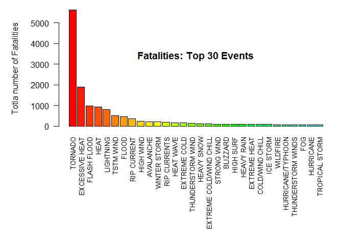

## Analysis of impact, both economic as victims, of different weather events in the USA based on the NOAA Storm Database

### Reproducible Research: Peer Assessment 2

#### 1. Assignment

The basic goal of this assignment is to explore the NOAA Storm Database and answer some basic questions about severe weather events. You must use the database to answer the questions below and show the code for your entire analysis. Your analysis can consist of tables, figures, or other summaries. You may use any R package you want to support your analysis.

#### 2. Synopsis

The National Oceanic and Atmospheric Administration (NOAA) maintains a public database for storm event. The data contains the type of storm event, details like location, date, estimates for damage to property as well as the number of human victims of the storm. In this report we investigate which type of events are the most harmful to the population and financially.

The conclusion is that the impact on humans, be it injuries or fatalities, isn't directly correlated to the ecomomic damage weather events cause. Tornado's are by far the highest cause for injuries (#1), and second in fatalities, whilst heat & drought cause the most fatalities, but fourth in injuries. Both are in the top 5 of injuries & fatalities next to Thunderstorms (resp #2 and #5), Flooding (#3 both) and Snow & Ice (resp. #5 and #4). In economic damages, only the property damage really factors in the total damage, except for Heat & Drought where more than 90% of damages is determined by crop damage. The #1 & #2 of weather damage sources, resp. Flooding & High Surf and Wind & Storm cover more than 80% of all economic cost, while Wind & Storm aren't even in the top 5 of victims.


```r
echo = TRUE  # Always make code visible
options(scipen = 1)  # Turn off scientific notations for numbers
library(stringr)
library(lubridate)
library(sqldf)
```

```
## Loading required package: gsubfn
```

```
## Loading required package: proto
```

```
## Loading required package: RSQLite
```

```
## Loading required package: DBI
```

```r
library(ggplot2)
library(reshape2)
library(gridExtra)
```

#### 3. Data Processing

The analysis was performed on Storm Events Database, provided by National Climatic Data Center. The data is from a comma-separated-value file available here. There is also some documentation of the data available here.

The first step is to read the data into a data frame.


```r
setwd("C:\\Users\\Vicky\\Downloads\\Compressed")
original_data <- read.csv("StormData.csv")
dim(original_data)
```

```
## [1] 902297     37
```

```r
head(original_data, n = 2)
```

```
##   STATE__          BGN_DATE BGN_TIME TIME_ZONE COUNTY COUNTYNAME STATE
## 1       1 4/18/1950 0:00:00     0130       CST     97     MOBILE    AL
## 2       1 4/18/1950 0:00:00     0145       CST      3    BALDWIN    AL
##    EVTYPE BGN_RANGE BGN_AZI BGN_LOCATI END_DATE END_TIME COUNTY_END
## 1 TORNADO         0                                               0
## 2 TORNADO         0                                               0
##   COUNTYENDN END_RANGE END_AZI END_LOCATI LENGTH WIDTH F MAG FATALITIES
## 1         NA         0                        14   100 3   0          0
## 2         NA         0                         2   150 2   0          0
##   INJURIES PROPDMG PROPDMGEXP CROPDMG CROPDMGEXP WFO STATEOFFIC ZONENAMES
## 1       15    25.0          K       0                                    
## 2        0     2.5          K       0                                    
##   LATITUDE LONGITUDE LATITUDE_E LONGITUDE_ REMARKS REFNUM
## 1     3040      8812       3051       8806              1
## 2     3042      8755          0          0              2
```

We will consider here only part of the information from original table, namely State, type of event, number of fatalities and injuries, estimate about damages.


```r
data <- original_data[,c("STATE", "EVTYPE", "FATALITIES", "INJURIES", "PROPDMG", "PROPDMGEXP","CROPDMG", "CROPDMGEXP")]
```

Still there are 902297, 8 observations in 72 states, including 1 undefined; the number of events considered is 985.

There are no missing values:


```r
sum (is.na (data))
```

```
## [1] 0
```

Some insights into data table:


```r
head(data)
```

```
##   STATE  EVTYPE FATALITIES INJURIES PROPDMG PROPDMGEXP CROPDMG CROPDMGEXP
## 1    AL TORNADO          0       15    25.0          K       0           
## 2    AL TORNADO          0        0     2.5          K       0           
## 3    AL TORNADO          0        2    25.0          K       0           
## 4    AL TORNADO          0        2     2.5          K       0           
## 5    AL TORNADO          0        2     2.5          K       0           
## 6    AL TORNADO          0        6     2.5          K       0
```


```r
summary(data)
```

```
##      STATE                      EVTYPE         FATALITIES      
##  TX     : 83728   HAIL             :288661   Min.   :  0.0000  
##  KS     : 53440   TSTM WIND        :219940   1st Qu.:  0.0000  
##  OK     : 46802   THUNDERSTORM WIND: 82563   Median :  0.0000  
##  MO     : 35648   TORNADO          : 60652   Mean   :  0.0168  
##  IA     : 31069   FLASH FLOOD      : 54277   3rd Qu.:  0.0000  
##  NE     : 30271   FLOOD            : 25326   Max.   :583.0000  
##  (Other):621339   (Other)          :170878                     
##     INJURIES            PROPDMG          PROPDMGEXP        CROPDMG       
##  Min.   :   0.0000   Min.   :   0.00          :465934   Min.   :  0.000  
##  1st Qu.:   0.0000   1st Qu.:   0.00   K      :424665   1st Qu.:  0.000  
##  Median :   0.0000   Median :   0.00   M      : 11330   Median :  0.000  
##  Mean   :   0.1557   Mean   :  12.06   0      :   216   Mean   :  1.527  
##  3rd Qu.:   0.0000   3rd Qu.:   0.50   B      :    40   3rd Qu.:  0.000  
##  Max.   :1700.0000   Max.   :5000.00   5      :    28   Max.   :990.000  
##                                        (Other):    84                    
##    CROPDMGEXP    
##         :618413  
##  K      :281832  
##  M      :  1994  
##  k      :    21  
##  0      :    19  
##  B      :     9  
##  (Other):     9
```

### Results

#### Fatalities

We investigate here the type of event that caused the largest total number of fatalities from 1950 to November 2011:


```r
fatal <- aggregate (FATALITIES~EVTYPE, data, sum)
fatal <- fatal [order(fatal$FATALITIES, decreasing=TRUE),]
par(mar=c(12, 6, 1, 1))
barplot (height = fatal$FATALITIES[1:30], names.arg = fatal$EVTYPE[1:30], las = 2, cex.names= 0.8,
         col = rainbow (30, start=0, end=0.5))
title (main = "Fatalities: Top 30 Events", line=-5)
title (ylab = "Totla number of Fatalities", line=4)
```



The histogram shows the total number of fatalities for the 30 top events, order by the total number of fatalities they have caused.

#### Injuries

We investigate here the type of event that caused the largest total number of injuries from 1950 to November 2011:


```r
injur <- aggregate (INJURIES~EVTYPE, data, sum)
injur <- injur [order(injur$INJURIES, decreasing=TRUE),]
par(mar=c(12, 6, 1, 1))
barplot (height = injur$INJURIES[1:30], names.arg = injur$EVTYPE[1:30], las = 2, cex.names = 0.8,
         col = rainbow (30, start=0, end=0.5))
title (main = "Injuries: Top 30 Events", line=-5)
title (ylab = "Total number of Injuries", line=4)
```


The histogram shows the total number of injuries for the 30 top events, order by the total number of injuries they have caused.

#### Economic Damages

We investigate here the total economic damage produced by each type of event, to evaluate those that caused the largest costs. Property and crop damages are summed-up over the years from 1950.


```r
symbol <- c("", "+", "-", "?", 0:9, "h", "H", "k", "K", "m", "M", "b", "B");
factor <- c(rep(0,4), 0:9, 2, 2, 3, 3, 6, 6, 9, 9)
multiplier <- data.frame (symbol, factor)

data$damage.prop <- data$PROPDMG*10^multiplier[match(data$PROPDMGEXP,multiplier$symbol),2]
data$damage.crop <- data$CROPDMG*10^multiplier[match(data$CROPDMGEXP,multiplier$symbol),2]
data$damage <- data$damage.prop + data$damage.crop

damage <- aggregate (damage~EVTYPE, data, sum);
damage$bilion <- damage$damage / 1e9;
damage <- damage [order(damage$bilion, decreasing=TRUE),]

par(mar=c(12, 6, 1, 1))
barplot (height = damage$bilion[1:30], names.arg = damage$EVTYPE[1:30], las = 2, cex.names = 0.8,
         col = rainbow (30, start=0, end=0.5))
title ("Damage: Top 30 Events", line=-5)
title (ylab = "Total damage (bilion USD)")
```


As opposed to previous results about human health, flood is the event that has caused the largest economic damage, as shown in the above histogram of the economic damage caused by the top 30 events.

### Conclusion

'Tornado' is the event that has most affected human health, both in terms of fatalities and injuries, over the years from 1950 to 2011. On the other hand, 'Flood' is the event linked to the largest economic damage, whith 'Tornado' only at 3rd place.
